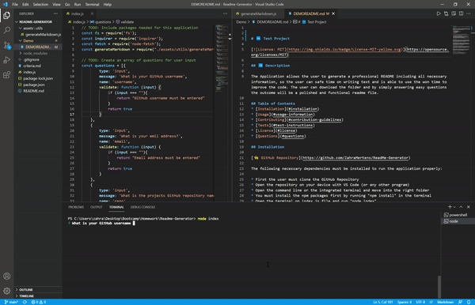
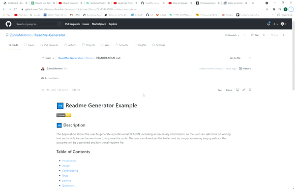

# Readme-Generator

## General Information

* [URL of the GitHub Repo](https://github.com/ZahraMertens/ReadMe-Generator.git)

## Table if Contents
1. [General Information](#general-informaion)
2. [Task Description](#task-description)
3. [Technologies Used](#technologies-used)
4. [Mock-Up](#mock-up)
5. [Bonus](#bonus)
6. [Credits](#credits)

## Task Describtion

## Technologies Used

* JavaScript

* NodeJS (npm packages: node-fetch & inquirer)

## Actual Behaviour

* 

* 

* 

* 

* 

## 🏆 Bonus

* 

* 

## Mock-Up

The video shows the usage of the code in the terminal to generate a new Readme File:

The video shows an example of a Readme file generated with the node.js application:

## Credits

* 
* 

